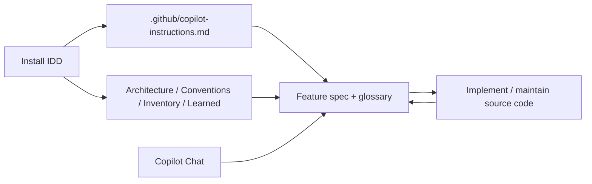

# IDD: Intent-Driven Development

Make repo context compound instead of evaporate.

IDD gives Copilot Chat a durable operating contract and a bounded artifact set
inside the repository. Instead of re-explaining the system in every session,
you keep architecture, conventions, inventory, learned rules, and feature
memory in the repo itself.

> IDD is not a runtime wrapper around the model.
>
> IDD is a repo-native contract and memory layer that better model generations
> can keep exploiting more effectively over time.

## North Star

The north star for AI-driven development in IDD is not raw code generation.

The north star is developing and maintaining feature specs, with Copilot's
assistance, so those specs can guide both source-code execution and later source
maintenance.

This is for software intent what IaC was for infrastructure: a durable,
reviewable, executable layer that compounds as the tooling gets better.

In practice that means:

- Copilot helps create or refresh the active feature spec before major code work.
- The active feature spec informs implementation scope, behavior, and constraints.
- The glossary anchors in that feature spec become the stable link back into the code.
- Later maintenance work starts from the feature spec and glossary, not from guesswork.

## Why IDD Exists

Without a repo contract, AI coding sessions start cold.

| Without IDD | With IDD |
|---|---|
| Context lives in transient chat history | Context lives in stable repo artifacts |
| New sessions re-discover the system from scratch | New sessions inherit architecture, conventions, inventory, and features |
| Prompts sprawl into ad hoc instructions | Work is grounded in named Markdown files with clear roles |
| Better models still waste effort rebuilding context | Better models get more leverage from the same repository memory |

## How IDD Works



The repository contract stays stable while the models improve. That is the
durable part of the design: the better the model gets, the more value it can
extract from the same artifact set, and the faster teams can iterate on
applications without rebuilding context from scratch.

## Why It Scales

1. The operating rules live in the repo, not in a shell wrapper.
2. Feature specs turn intent into a stable execution surface instead of a transient prompt.
3. Each task can refresh repository memory instead of letting it decay.
4. New model generations can read the same files with better judgment,
   synthesis, and consistency review.
5. The repository becomes compounding engineering infrastructure rather than disposable chat state.

## Why This Matters

This is not just a better prompting workflow.

It is a change in where engineering intent lives.

- IaC made infrastructure declarative, reviewable, and automatable. IDD does the same for application intent.
- Teams can iterate on products with unusual speed because the agent starts from maintained feature contracts instead of cold-start rediscovery.
- Each new LLM generation increases the value extracted from the same repository memory instead of forcing a process reset.
- Initial implementation and later maintenance run through the same feature artifact, so velocity does not collapse after greenfield codegen.
- The repository becomes a durable substrate for human and agent collaboration, which is why this looks like a new engineering paradigm rather than a temporary tooling layer.

## Install

```bash
curl -fsSL https://raw.githubusercontent.com/dan1hc/idd/main/install.sh | bash
```

The installer:

- creates `.github/idd/`
- downloads `.github/copilot-instructions.md` and the feature template
- scaffolds the top-level IDD artifacts if they do not exist yet
- mirrors the same operating contract to `.cursorrules` and `CLAUDE.md` when possible

| Tool | Reads from |
|------|-----------|
| Cursor | `.cursorrules` |
| Claude Code | `CLAUDE.md` |
| GitHub Copilot | `.github/copilot-instructions.md` |

## Use It In Chat

The canonical operating contract for Copilot Chat lives in
`.github/copilot-instructions.md`.

### Brownfield

```text
Discover this repository and populate the IDD context files.
Create a bounded feature spec for audit logging using the current IDD artifacts.
Implement the active feature and update its glossary before finishing.
Review the IDD artifacts for consistency with the implemented work.
```

### Greenfield

```text
Set up IDD for a greenfield product with a web app, an API, and the first feature we should build.
Create the first feature spec from the current architecture and constraints.
Implement the active feature and keep the glossary aligned with the code you create.
Review the IDD artifacts for consistency with the implemented feature.
```

## Artifact Model

IDD uses Markdown-first context files instead of JSON runtime artifacts.

| File | Purpose |
|---|---|
| `.github/copilot-instructions.md` | Canonical operating contract for Copilot Chat |
| `.github/idd/architecture.md` | System shape, runtime topology, integrations, and open questions |
| `.github/idd/conventions.md` | Code style, boundaries, library patterns, and component placement |
| `.github/idd/inventory.md` | Repository surfaces, entrypoints, routes, jobs, and evidence |
| `.github/idd/learned.md` | Explicit user-approved rules that override discovered conventions |
| `.github/idd/features/*.md` | The primary planning and execution layer: bounded feature specs with acceptance criteria and glossary anchors |

## Why Feature Specs Matter

Feature specs are the working center of IDD.

They are where intent stops being conversational and starts becoming durable.

Feature files live in `.github/idd/features/`. Each one records:

- what the feature does
- acceptance criteria
- constraints and dependencies
- technical considerations
- a glossary of stable `file::symbol` anchors

The feature spec guides implementation.

The glossary is what lets later maintenance reconnect that implementation back
to the feature that justified it.

That is why feature specs are more than planning notes. They are the durable
intent layer that lets engineering speed and engineering capability scale with
the model frontier.

## Installed Footprint

```text
.github/
├── copilot-instructions.md
└── idd/
    ├── architecture.md
    ├── conventions.md
    ├── inventory.md
    ├── learned.md
    └── features/
        ├── _template.md
        └── *.md
```

## License

[LGPL](LICENSE)

