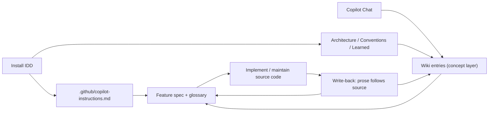

# IDD: Intent-Driven Development

[](#north-star)
[](#use-it-in-chat)
[](#artifact-model)
[](#why-this-matters)
[](#license)

Write applications, not source code.

IDD is a repo-native contract for describing software in natural language.
You and Copilot maintain the intent — a wiki of concepts, feature specs,
architecture, conventions, learned rules — and the model maintains the
code. It is dramatically more productive than hand-writing every line,
and it gets better every time the model does.

> IDD is not a runtime wrapper around the model.
>
> IDD is the natural-language layer where applications are now authored,
> reviewed, and maintained. Source code becomes a compiled artifact of
> the intent stored in the repo.
## North Star

Intent in IDD flows in one direction: **wiki → feature specs → execution →
write-back**.

- You and Copilot think in the wiki. A concept, subsystem, or feature is
  fleshed out as one or more wiki entries before any code is written.
- Copilot derives feature specs from those wiki entries. A wiki entry
  holds the durable concept; feature specs are Copilot's instructions
  for implementing or modifying it. A single wiki entry can spawn many
  feature specs over its lifetime — one per bounded change.
- Copilot executes specs sequentially under Red / Green TDD, then writes
  back so wiki and specs follow source.
- Later maintenance starts from the same wiki + spec pair, not from
  guesswork.

This is for software intent what IaC was for infrastructure: a durable,
reviewable, executable layer that compounds as the tooling gets better.

## Why IDD Exists

Hand-writing source code is the slow path. Asking a fresh chat to
regenerate it every session is the brittle path. IDD is the path where
the application lives as maintained intent and the model keeps the code
in sync.

| Hand-written code | Cold AI chat | With IDD |
|---|---|---|
| Intent only lives in the author's head | Intent only lives in the transient prompt | Intent lives in versioned Markdown the team owns |
| Maintenance means re-reading source | Maintenance restarts from zero context | Maintenance restarts from wiki + feature specs |
| Refactors break unwritten assumptions | Refactors break what the chat forgot | Refactors update intent first; code follows |
| Productivity capped by typing speed | Productivity capped by re-explaining context | Productivity capped by how fast you can think clearly |

## How IDD Works



The wiki is where new intent enters the system. You and Copilot work a
concept into one or more wiki entries first; Copilot then breaks that into
bounded feature specs for execution. The three anchor forms IDD uses to
link these layers are:

- `code::<path>::<symbol>` for stable code or Markdown anchors
- `feature::<feature-id>::ac-N` for numbered acceptance criteria
- `wiki::<topic>::<section>` for sections inside wiki entries

Discovery and large sweeps are dispatched to read-only sub-agents; the main
agent is the only writer. After every code-changing task, a write-back pass
repairs anchors and prose so docs match the code.

Four user-initiated slash commands drive the workflow:

- `/idd-discover` — brownfield: seed architecture, conventions, and wiki entries from existing code.
- `/idd-init` — greenfield: interview the user and write the first artifacts.
- `/idd-feature` — derive a bounded feature spec from a wiki entry.
- `/idd-lint` — repo-wide sweep for drift, duplicates, orphans, and broken anchors.

The repository contract stays stable while the models improve. That is the
durable part of the design: the better the model gets, the more value it can
extract from the same artifact set, and the faster teams can iterate on
applications without rebuilding context from scratch.

## Enforcement

Learned rules are compiled, not merely read. `learned.md` stays the
single authored source of truth; approving a rule compiles it into the
native enforcement surfaces of each tool in the same session:

Everything runs in-session — IDD wires no CI and no external hook
manager:

- **Mechanical rules** widen the repo's existing linter config, or
  become committed ast-grep checks under `.github/idd/checks/` that
  session hooks run on every edit and again as a blocking gate when
  the session commits — deterministic code only, no LLM in the commit
  path. The hooks are wired per-harness: Claude Code and GitHub
  Copilot (CLI, cloud coding agent, VS Code agent mode) run the same
  checks from one checked-in file each. Every check ships with a
  fixture pair proving it actually fires — a dead check is
  indistinguishable from compliance, so check compilation is itself
  Red/Green.
- **Judgment rules** compile into path-scoped instruction files
  (Copilot `applyTo` instructions, nested `CLAUDE.md` sections,
  `.cursor/rules`) so they're injected at edit time, and a mandatory
  in-session review re-checks the diff against exactly the rules whose
  scope matches before it is proposed for human review — riding the
  session's own model access, no extra credential.
- **Enforced rules drop out of prose entirely**, which keeps the rule
  set the model actually reads small enough to stay salient.

This layer is capability-invariant by design: better models improve
judgment quality, but a team-specific choice among equally valid options
can never be inferred — only retrieved, reliably, every time.

## Why It Scales

1. The operating rules live in the repo, not in a shell wrapper.
2. The wiki captures concepts once; feature specs derive from it.
3. Each task can refresh repository memory instead of letting it decay.
4. New model generations can read the same files with better judgment,
   synthesis, and consistency review.
5. The repository becomes compounding engineering infrastructure rather than disposable chat state.

## Why This Matters

This is not just a better prompting workflow. It is a change in what a
software engineer's day-to-day artifact is.

- The unit of work moves up the stack: from lines of code to wiki entries
  and feature specs written in plain English.
- IaC made infrastructure declarative, reviewable, and automatable. IDD does the same for application logic.
- Teams ship product faster because the agent starts from maintained
  intent instead of cold-start rediscovery, and humans review meaning
  instead of syntax.
- Each new LLM generation extracts more value from the same repository
  memory — the natural-language artifacts don't need to change for the
  output to improve.
- Initial implementation and later maintenance run through the same
  wiki and feature artifacts, so velocity does not collapse after the
  greenfield burst.
- The repository becomes a durable substrate for human and agent
  collaboration. That is why this is a paradigm shift, not a tooling
  layer.

## Install

```bash
curl -fsSL https://raw.githubusercontent.com/dan1hc/idd/main/install.sh | bash
```

The installer is additive — it never clobbers a file IDD does not
solely own:

- creates `.github/idd/` and scaffolds the top-level IDD artifacts if they do not exist yet
- downloads `.github/copilot-instructions.md`, the feature/wiki/check templates, and the slash-command prompts
- wires `sgconfig.yml` so ast-grep finds the committed checks (created if missing, extended if present)
- injects the operating contract into `.cursorrules` and `CLAUDE.md` behind `idd:begin`/`idd:end` markers, preserving existing content
- creates `.claude/settings.json` hooks — edit-time checks plus the in-session commit gate — when the file does not already exist
- installs `.github/hooks/idd.json` — the same hooks in GitHub Copilot's envelope, read by the Copilot CLI, cloud coding agent, and VS Code agent mode

| Tool | Reads from |
|------|-----------|
| Cursor | `.cursorrules` |
| Claude Code | `CLAUDE.md` |
| GitHub Copilot | `.github/copilot-instructions.md` |

## Artifact Model

IDD uses Markdown-first context files the team owns and edits.

| File | Purpose |
|---|---|
| `.github/copilot-instructions.md` | Canonical operating contract for Copilot Chat |
| `.github/idd/architecture.md` | System shape, runtime topology, integrations, and open questions |
| `.github/idd/conventions.md` | Code style, boundaries, library patterns, and component placement |
| `.github/idd/wiki/*.md` | Durable concept map: bounded entries that feature specs and the contract anchor at |
| `.github/idd/learned.md` | Explicit user-approved rules that override discovered conventions — the authored source the enforcement layer compiles |
| `.github/idd/checks/*.yml` | Compiled ast-grep checks for `mechanical` learned rules, run by the gates and in-session hooks |
| `.github/idd/check-tests/*-test.yml` | Fixture pairs proving each check fires — a dead check looks like compliance; `/idd-lint` re-runs the suite |
| `.github/idd/templates/*` | Session-hook templates the installer wires additively (edit-time checks, in-session commit gate) — one envelope per harness: Claude Code and GitHub Copilot |
| `.github/hooks/idd.json` | The compiled Copilot hooks — same checks, Copilot's stdout-JSON envelope |
| `.github/idd/features/*.md` | The primary planning and execution layer: bounded feature specs with acceptance criteria and glossary anchors |
| `.github/prompts/idd-discover.prompt.md` | On-demand `/idd-discover` command for brownfield discovery |
| `.github/prompts/idd-init.prompt.md` | On-demand `/idd-init` command for greenfield bootstrap |
| `.github/prompts/idd-feature.prompt.md` | On-demand `/idd-feature` command to derive a feature spec from a wiki entry |
| `.github/prompts/idd-lint.prompt.md` | On-demand `/idd-lint` command for repo-wide drift, duplicate, orphan, and broken-anchor sweeps |

## Why Feature Specs Matter

The wiki is where new intent enters the system. Feature specs are where
that intent becomes executable.

A feature spec turns a wiki concept into a bounded slice the model can
implement and maintain. Each one records:

- what the feature does
- acceptance criteria
- constraints and dependencies
- technical considerations
- a glossary of stable anchors back into source code

The spec guides implementation. The glossary lets the next session —
human or model — reconnect the code to the intent that justified it.

That is why feature specs are more than planning notes. They are the
durable execution contract that lets a team write applications instead
of source code, and keep doing so as the model frontier moves.

## Installed Footprint

```text
.github/
├── copilot-instructions.md
├── hooks/
│   └── idd.json
├── prompts/
│   ├── idd-discover.prompt.md
│   ├── idd-init.prompt.md
│   ├── idd-feature.prompt.md
│   └── idd-lint.prompt.md
└── idd/
    ├── architecture.md
    ├── conventions.md
    ├── learned.md
    ├── checks/
    │   ├── _template.yml
    │   └── *.yml
    ├── check-tests/
    │   ├── _template-test.yml
    │   └── *-test.yml
    ├── templates/
    │   ├── claude-settings-hooks.json
    │   └── copilot-hooks.json
    ├── wiki/
    │   ├── _template.md
    │   └── *.md
    └── features/
        ├── _template.md
        └── *.md
sgconfig.yml
.claude/settings.json
```

## License

[LGPL](LICENSE)

